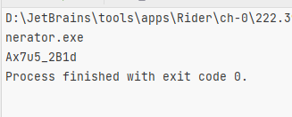

# hw-1

## Задание 0

1. Скачал Rider и .NET framework 4.6.2
2. Немного изменил кофигурационные файлы
3. Запустил unit-testы
4. 

## Задание 1

Пример работы:

## Задание 2

Пример работы:

## Задание 3

