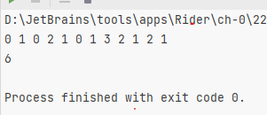

# hw-2

## Задание 1

Пример работы:
```
add 2 abcde
Size = 1
add 3 kek
Size = 2
add 5 luck
Size = 3
add 10 unluck
Size = 4
contains 5
True
Size = 4
contains 6
False
Size = 4
get 2
abcde
Size = 4
add 2 super
Size = 4
get 2
super
Size = 4
remove 2
Size = 3
contains 2
False
Size = 3
```

## Задание 2

## Задание 3

## Задание 4

## Задание 5

Пример работы:

